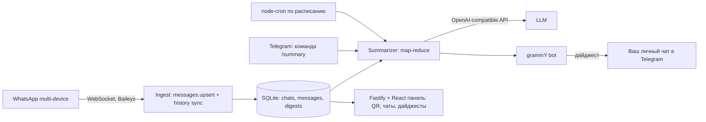

## Ответ на главный вопрос

Да, схема рабочая. WhatsApp с 2021 года поддерживает multi-device: связанное устройство (как WhatsApp Web/Desktop) держит собственную сессию и получает сообщения даже когда телефон выключен. Мы делаем такое «устройство» на VDS через библиотеку Baileys — она говорит с WhatsApp по WebSocket напрямую, без браузера и Selenium.

Телефон нужен ровно один раз: Настройки -> Связанные устройства -> сканировать QR из веб-панели. Дальше сессия живёт в файлах на VDS и переживает перезапуски.

## Архитектура



Один долгоживущий Node-процесс: WhatsApp-сокет, Telegram-бот, планировщик и HTTP-панель внутри него. Так проще всего — сессия Baileys не любит перезапуски и несколько процессов.

## Стек

- Node 22, TypeScript, ESM, `tsx` в dev
- `@whiskeysockets/baileys` **строго 6.7.24** (тег `legacy`). Версия `latest` сейчас `7.0.0-rc14`, и там открытый баг [#2737](https://github.com/WhiskeySockets/baileys/issues/2737): QR-привязка не завершается, а `requestPairingCode()` возвращает недействительный код. Пин в `package.json` + комментарий в README про апгрейд
- `better-sqlite3` — хранилище (синхронный, WAL, без отдельного сервиса)
- `openai` SDK с настраиваемым `baseURL` -> OpenAI, OpenRouter, DeepSeek, Ollama, что угодно
- `grammy` — Telegram-бот, `node-cron` — расписание, `fastify` — API и раздача панели
- Панель: Vite + React + Tailwind + shadcn/ui

## Критичные настройки поведения

Чтобы приложение не мешало вам и не выдавало себя:

```ts
const sock = makeWASocket({
  auth: state,
  browser: Browsers.macOS('Desktop'), // desktop-профиль отдаёт больше истории
  syncFullHistory: true,
  markOnlineOnConnect: false, // иначе телефон перестанет присылать пуши
})
```

- **Никогда** не вызываем `sock.readMessages()` и `sendPresenceUpdate('available')` — чаты остаются непрочитанными, вы не светитесь «в сети», прочтения не отправляются
- В коде вообще нет пути отправки сообщений в WhatsApp: только чтение
- Догрузка старой переписки: `sock.fetchMessageHistory(50, oldestKey, oldestTs)` пачками по 50, результат приходит в событие `messaging-history.set`

## Файлы

- `src/config.ts` — env через zod: `OPENAI_API_KEY`, `OPENAI_BASE_URL`, `LLM_MODEL`, `TELEGRAM_BOT_TOKEN`, `TELEGRAM_CHAT_ID`, `DIGEST_CRON`, `TZ`, `DASHBOARD_TOKEN`, `PORT=43117`, `RETENTION_DAYS`, `DEMO_MODE`
- `src/db/schema.ts` — таблицы:
  - `chats(jid PK, name, is_group, tracked, last_message_at, message_count)`
  - `messages(id PK, chat_jid, sender_jid, sender_name, ts, from_me, kind, text, quoted_text)` + индекс `(chat_jid, ts)`
  - `digests(id, chat_jid, period_start, period_end, message_count, model, summary_md, created_at, delivered_at, tokens_in, tokens_out)`
  - `settings(key, value)` — расписание и период правятся из панели без рестарта
- `src/whatsapp/client.ts` — менеджер соединения: `useMultiFileAuthState('data/auth')`, состояния `needs_pairing / qr / connecting / open / logged_out`, реконнект с backoff, алерт в Telegram при разрыве и при `DisconnectReason.loggedOut`
- `src/whatsapp/ingest.ts` — извлечение текста из всех типов: `conversation`, `extendedTextMessage.text`, подписи к фото/видео, `documentMessage` -> `[файл: имя]`, голосовые -> `[голосовое NN сек]`, реакции, цитируемое сообщение как контекст, `pushName` как имя автора
- `src/summarize/` — map-reduce: выборка окна, форматирование в `[HH:MM] Имя: текст`, нарезка на чанки при переполнении бюджета символов, summary каждого чанка, затем сведение в итог. Промпт на русском, секции: о чём говорили, решения и договорённости, вопросы и просьбы лично к вам, важные ссылки и файлы, кто был активен
- `src/telegram/bot.ts` — allowlist по вашему chat id, команды `/start`, `/status`, `/chats` (инлайн-кнопки «следить / не следить»), `/summary [период]`, `/digest`, `/settings`, `/help`. Разбивка длинных ответов по лимиту 4096 символов
- `src/scheduler.ts` — cron с таймзоной + ночная чистка по `RETENTION_DAYS`
- `src/http/server.ts` — `/api/status`, `/api/qr`, `/api/chats`, `/api/chats/:jid/track`, `/api/digests`, `POST /api/digests/run`, `/api/settings`; доступ по `DASHBOARD_TOKEN`, статика панели
- `web/` — 4 экрана: Подключение (QR и статус сессии), Чаты (поиск + переключатели слежения, счётчики сообщений), Дайджесты (история, просмотр, «сделать сейчас»), Настройки (расписание, период, модель). Пустые, загрузочные и ошибочные состояния везде
- `Dockerfile`, `docker-compose.yml`, `deploy/wa-digest.service`, `.env.example`, `README.md`

`DEMO_MODE=1` подменяет WhatsApp-адаптер на фейковый с посеянными чатами и дайджестами — чтобы посмотреть панель без привязки живого аккаунта.

## Ограничения, о которых надо знать заранее

- **История.** Связанное устройство получает историю только при первичной привязке (обычно последние месяцы того, что лежит на телефоне), плюс мы можем догружать пачками через `fetchMessageHistory`. Переписку за все годы вытащить нельзя
- **Риск блокировки.** Baileys — неофициальный клиент, это формально нарушение ToS WhatsApp, аккаунт теоретически могут заблокировать. Снижаем риск: только чтение, никаких рассылок, одно связанное устройство, не переподключаемся без нужды
- **Ключи шифрования лежат на VDS.** Кто получил root на сервере — получил доступ к вашим чатам. В README: файрвол на порт панели, обязательный `DASHBOARD_TOKEN`, желательно доступ только через SSH-туннель
- **Чужие сообщения уходят в LLM.** Остальные участники чата об этом не знают. Если чат чувствительный — в README будет вариант с локальной моделью через Ollama, тот же OpenAI-совместимый интерфейс
- **Стоимость.** Оживлённый чат на 1000 сообщений в сутки — это примерно 60–100 тыс. токенов на дайджест, то есть копейки на дешёвой модели. В панели видно расход токенов по каждому дайджесту

## Порядок работы

Сначала поднимаю каркас и панель, показываю превью, потом наращиваю ingest, summary и Telegram. Коммичу и пушу на текущую ветку по ходу дела.
